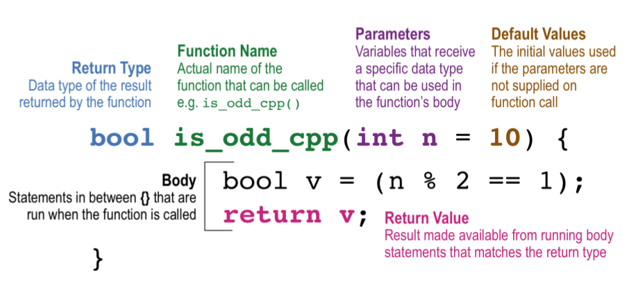
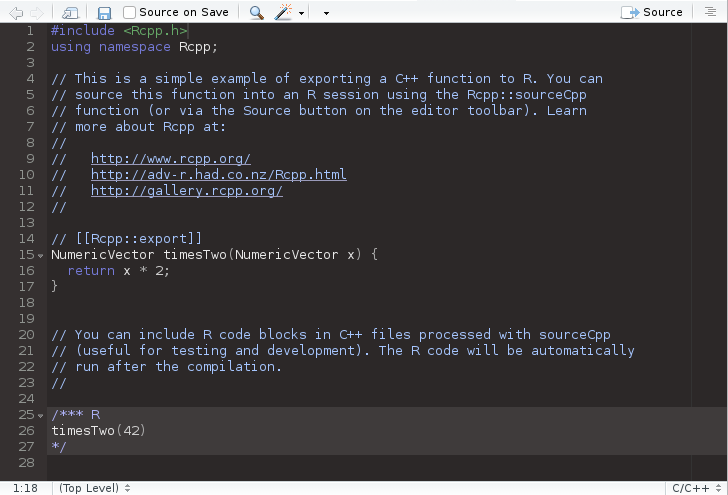
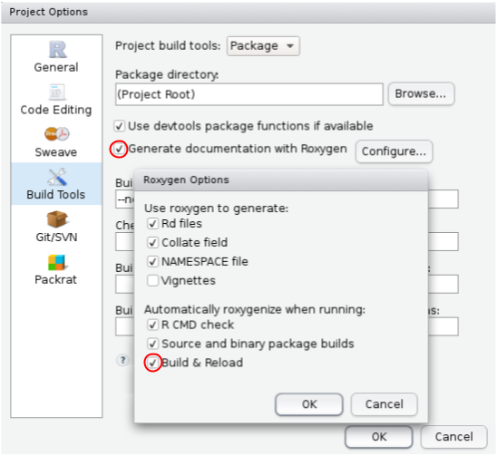

```{r setup, include=FALSE}
knitr::opts_chunk$set(echo = FALSE, fig.align = "center", dev = "svg",
                      out.width = "80%")
options(width = 70)
Sys.setenv(LANGUAGE = "en")
```

class: center, middle, inverse

# Introduction

---

## Resources

### Rcpp

- [Advanced R](https://adv-r.hadley.nz/rcpp.html)

- [Rcpp for everyone](https://teuder.github.io/rcpp4everyone_en/)

- [Rcpp Gallery](http://gallery.rcpp.org/)

<br>

### RcppArmadillo (linear algebra)

- [RcppArmadillo cheatsheet](https://github.com/petewerner/misc/wiki/RcppArmadillo-cheatsheet)

- [Armadillo documentation](http://arma.sourceforge.net/docs.html)

- [Fix OS X Mavericks "-lgfortran" and "-lquadmath" installation errors](https://thecoatlessprofessor.com/programming/rcpp-rcpparmadillo-and-os-x-mavericks--lgfortran-and--lquadmath-error/)

---

## How I see Rcpp?

<br>

Rcpp lives between R and C++, so that you can get 

- the *performance of C++* and

- the *convenience of R*.

<br>

As 

- I love *performance* and 

- I also enjoy *simplicity*, 

Rcpp might be my favorite R package.

.footnote[I often speak about Rcpp as if it were a programming language.]

---

## Using Rcpp with RStudio

```{r}
knitr::include_graphics("http://li-kan.com/image/post/Rcpp/create_file.png")
```

Learn more at https://support.rstudio.com/hc/en-us/articles/200486088-Using-Rcpp-with-RStudio.

---

## First main example: testing if number is odd

In R:

```{r, echo=TRUE}
is_odd_r <- function(n = 10) {
  n %% 2 == 1
}
```

In Rcpp:

```{Rcpp, echo=TRUE, cache=TRUE}
// [[Rcpp::export]]
bool is_odd_cpp(int n = 10) {
  bool v = (n % 2 == 1);
  return v;
}
```

```{r, echo=TRUE}
c(is_odd_r(),   is_odd_cpp(), 
  is_odd_r(21), is_odd_cpp(21),
  is_odd_r(42), is_odd_cpp(42))
```

---

## C++ function explained

### C++ is statically typed

```{r, fig.cap="Graphical annotation of the <em>is_odd_cpp</em> function.<br/><small>https://doi.org/10.7287/peerj.preprints.3188v1</small>"}

```

.footnote[You don't really need `v` here.]

---

## Whole Rcpp file

```{r, out.width="80%"}

```

.footnote[<mark>Source</mark>: compile the Rcpp function and execute the block of R code.]

---

## Second main example: sum of a vector

```{r, echo=TRUE}
sumR <- function(x) {
  total <- 0
  for (i in seq_along(x)) {
    total <- total + x[i]
  }
  total
}
```

```{Rcpp, echo=TRUE, cache=TRUE}
#include <Rcpp.h>
using namespace Rcpp;

// [[Rcpp::export]]
double sumC1(const NumericVector& x) {
  
  int n = x.size();
  double total = 0;
  for (int i = 0; i < n; i++) {
    total += x[i];
  }
  
  return total;
}
```

---

The C++ version is similar, but:

* To find the length of the vector, we use the `.size()` method (or `.length()`),   which returns an integer. C++ methods are called with `.` (i.e., a full stop).
  
* The `for` statement has a different syntax: `for(init; check; increment)`. 
  This loop is initialised by creating a new variable called `i` with value 0.
  Before each iteration we check that `i < n`, and terminate the loop if it's 
  not. After each iteration, we increment the value of `i` by one, using the
  special prefix operator `++` which increases the value of `i` by 1.

* In C++, vector indices start at 0. I'll say this again because it's so 
  important: __IN C++, VECTOR INDICES START AT 0__! This is a very common 
  source of bugs when converting R functions to C++.

* Use `=` for assignment, not `<-`.

* C++ provides operators that modify in-place: `total += x[i]` is equivalent to 
  `total = total + x[i]`. Similar in-place operators are `-=`, `*=`, and `/=`.

---

## Rcpp Sugar

With [Rcpp Sugar](http://dirk.eddelbuettel.com/code/rcpp/Rcpp-sugar.pdf), you have accessed to some R-like vectorized functions:

```{Rcpp, echo=TRUE, cache=TRUE}
#include <Rcpp.h>
using namespace Rcpp;

// [[Rcpp::export]]
double sumCS(const NumericVector& x) {
  return sum(x);
}
```

There are many [R-like functions available in Rcpp](https://teuder.github.io/rcpp4everyone_en/210_rcpp_functions.html).

---

## Yet other possibilities

```{Rcpp, echo=TRUE, cache=TRUE}
#include <Rcpp.h>
using namespace Rcpp;


// [[Rcpp::export]]
double sumC2(const NumericVector& x) {
  
  double total = 0;
  NumericVector::const_iterator it;
  for (it = x.begin(); it != x.end(); it++) {
    total += *it;
  }
  return total;
}


// [[Rcpp::export]]
double sumC3(const NumericVector& x) {
  return std::accumulate(x.begin(), x.end(), 0.0);
}
```

---

## Microbenchmark

```{r, echo=TRUE}
x <- runif(1e5)

microbenchmark::microbenchmark(
  "R LOOP" = sumR(x),
  "R VEC"  = sum(x),
  "C LOOP" = sumC1(x),
  "C VEC"  = sumCS(x),
  "C IT"   = sumC2(x),
  "C STD"  = sumC3(x)
)
```

---

## Rcpp main types

<br>

```{r}
htmlTable::htmlTable(
  tibble::tibble(
    R = c("logical", "integer", "double", "character"),
    `Rcpp (scalar)` = c("bool", "int", "double", "String"),
    `Rcpp (vector)` = c("LogicalVector", "IntegerVector", "NumericVector", "CharacterVector"),
    `Rcpp (matrix)` = c("LogicalMatrix", "IntegerMatrix", "NumericMatrix", "CharacterMatrix")
  ), 
  rnames = FALSE, 
  align = "c|ccc", align.header = "c|ccc",
  css.table = "margin-top: 1em; margin-bottom: 1em; margin-left: auto; margin-right: auto",
  css.cell = "padding: 10px 20px 10px 20px"
)
```

<br>

There are also `List` and `DataFrame` (but prefer using `List`).

---

class: center, middle, inverse

# Quiz

---

## Which R functions does this implement? (1/5)

```{Rcpp, echo=TRUE, cache=TRUE}
#include <Rcpp.h>
using namespace Rcpp;

// [[Rcpp::export]]
double f1(NumericVector x) {
  
  int n = x.size();
  double y = 0;

  for (int i = 0; i < n; i++) {
    y += x[i];
  }
  
  return y / n;
}
```

---

## Which R functions does this implement? (2/5)

```{Rcpp, echo=TRUE, cache=TRUE}
#include <Rcpp.h>
using namespace Rcpp;

// [[Rcpp::export]]
NumericVector f2(NumericVector x) {
  
  int n = x.size();
  NumericVector out(n);

  out[0] = x[0];
  for (int i = 1; i < n; i++) {
    out[i] = out[i - 1] + x[i];
  }
  
  return out;
}
```

---

## Which R functions does this implement? (3/5)

```{Rcpp, echo=TRUE, cache=TRUE}
#include <Rcpp.h>
using namespace Rcpp;

// [[Rcpp::export]]
bool f3(LogicalVector x) {
  
  int n = x.size();

  for (int i = 0; i < n; i++) {
    if (x[i]) return true;
  }
  
  return false;
}
```

---

## Which R functions does this implement? (4/5)

```{Rcpp, echo=TRUE, cache=TRUE}
#include <Rcpp.h>
using namespace Rcpp;

// [[Rcpp::export]]
NumericVector f4(List x) {
  
  int n = x.size();
  NumericVector res(n);

  for (int i = 0; i < n; i++) {
    res[i] = mean( as<NumericVector>(x[i]) );
  }
  
  return res;
}
```

---

## Which R functions does this implement? (5/5)

```{Rcpp, echo=TRUE, cache=TRUE}
#include <Rcpp.h>
using namespace Rcpp;

// [[Rcpp::export]]
NumericVector f5(NumericVector x, NumericVector y) {
  
  // Recycling
  int n = std::max(x.size(), y.size());
  NumericVector x_rep = rep_len(x, n);
  NumericVector y_rep = rep_len(y, n);

  NumericVector out(n);

  for (int i = 0; i < n; i++) {
    out[i] = std::min(x_rep[i], y_rep[i]);
  }

  return out;
}
```

---

## Which R functions does this implement? (answers)

```{r, echo=TRUE}
x <- runif(100)
stopifnot(isTRUE(all.equal(f1(x), mean(x))))
```

```{r, echo=TRUE}
stopifnot(isTRUE(all.equal(f2(x), cumsum(x))))
```

```{r, echo=TRUE}
x2 <- rep(FALSE, 10)
stopifnot(isTRUE(all.equal(f3(x2), any(x2))))
x2[1] <- TRUE
stopifnot(isTRUE(all.equal(f3(x2), any(x2))))
x2[] <- TRUE
stopifnot(isTRUE(all.equal(f3(x2), any(x2))))
```

```{r, echo=TRUE}
x3 <- lapply(1:10, runif)
stopifnot(isTRUE(all.equal(f4(x3), sapply(x3, mean))))
```

```{r, echo=TRUE}
x4 <- runif(11)
stopifnot(isTRUE(all.equal(f5(x, x4), pmin(x, x4))))
```

---

class: center, middle, inverse

# More

---

## Use of C++ code when needed

.footnote[More infos [there](http://adv-r.had.co.nz/Rcpp.html).]

<br>

Typical bottlenecks that C++ can address include:

- Recursive functions, or problems which involve calling functions **millions of times**. 
The overhead of calling a function in C++ is much lower than that in R.

- Loops that **can’t be easily vectorised** because subsequent iterations depend on previous ones.

- Problems that require **advanced data structures** and algorithms that R doesn’t provide. Through the standard template library (STL), C++ has efficient implementations of many important data structures, from ordered maps to double-ended queues. See [this chapter](https://adv-r.hadley.nz/rcpp.html#stl).

---

## Third main example: Gibbs sampler

```{r, echo=TRUE}
gibbs_r <- function(N, thin) {
  
  mat <- matrix(nrow = 2, ncol = N)
  x <- y <- 0

  for (i in 1:N) {
    for (j in 1:thin) {
      x <- rgamma(1, 3, y * y + 4)
      y <- rnorm(1, 1 / (x + 1), 1 / sqrt(2 * (x + 1)))
    }
    mat[, i] <- c(x, y)
  }
  
  mat
}
```

<br>

This function can't be vectorized because iterations depend on previous ones.

---

### Recode it in Rcpp

```{Rcpp, echo=TRUE, cache=TRUE}
#include <Rcpp.h>
using namespace Rcpp;

// [[Rcpp::export]]
NumericMatrix gibbs_cpp(int N, int thin) {
  
  NumericMatrix mat(2, N);
  double x = 0, y = 0;

  for(int i = 0; i < N; i++) {
    for(int j = 0; j < thin; j++) {
      x = rgamma(1, 3, 1 / (y * y + 4))[0]; // 3rd param -> inverse
      y = rnorm(1, 1 / (x + 1), 1 / sqrt(2 * (x + 1)))[0];
    }
    mat(0, i) = x;
    mat(1, i) = y;
  }

  return(mat);
}
```

There is not much difference with the previous R version!

---

### Microbenchmark

```{r, echo=TRUE}
microbenchmark::microbenchmark(
  gibbs_r(100, 10),
  gibbs_cpp(100, 10),
  gibbs_r(1000, 10),
  gibbs_cpp(1000, 10)
)
```

---

## Other examples of Rcpp code

<a href="https://github.com/hadley/adv-r/blob/master/extras/cpp" target="_blank">
```{r}
webshot::webshot("https://github.com/hadley/adv-r/blob/master/extras/cpp")
```
</a>

---

## Missing values

```{Rcpp, echo=TRUE, cache=TRUE}
#include <Rcpp.h>
using namespace Rcpp;

// [[Rcpp::export]]
List scalar_missings() {
  
  int    int_s = NA_INTEGER;
  String chr_s = NA_STRING;
  bool   lgl_s = NA_LOGICAL;
  double num_s = NA_REAL;

  return List::create(int_s, chr_s, lgl_s, num_s);
}
```

```{r, echo=TRUE}
str(scalar_missings())
```

---

## Two traps in one

```{Rcpp, echo=TRUE, cache=TRUE}
#include <Rcpp.h>
using namespace Rcpp;

// [[Rcpp::export]]
void copy_vec(NumericVector x) {
  NumericVector y = x;
  y[0] = 100;
}
```

```{r, echo=TRUE}
x2 <- runif(10)
copy_vec(x2)
x2
x1 <- 1:10
copy_vec(x1)
x1
```

---

## Two traps in one, explanation

- R objects are always passed by reference in Rcpp (even without the `&`). Use `clone()` to get a copy.

- But if e.g. passing a vector of type integer (`1:10`) as a NumericVector (type double), the vector will be copied (and casted to type double).

```{Rcpp, echo=TRUE, cache=TRUE}
#include <Rcpp.h>
using namespace Rcpp;

// [[Rcpp::export]]
void copy_vec2(NumericVector x) {
  NumericVector y = clone(x);
  y[0] = 100;
}
```

```{r, echo=TRUE}
x2 <- runif(10)
copy_vec2(x2)
x2
```

---

## Yet another trap (of C++)

```{Rcpp, echo=TRUE, cache=TRUE}
#include <Rcpp.h>
using namespace Rcpp;

// [[Rcpp::export]]
double int_div() {
  int x = 2, y = 3;
  double z = x / y;
  return z;
}

// [[Rcpp::export]]
double int_div2() {
  int x = 2, y = 3;
  return (double)x / y;
}
```

```{r, echo=TRUE}
c(int_div(), int_div2())
```

---

class: center, middle, inverse

# Rcpp in an R package


---

## Create a package (in RStudio)

```{r, echo=TRUE, eval=FALSE}
# In a new RStudio project, run
usethis::use_description()
usethis::use_namespace()
usethis::use_package_doc()
usethis::use_roxygen_md()
```

**Restart RStudio** and change the following options:

```{r, out.width="50%"}

```

---

## Add Rcpp to your package

```{r, echo=TRUE, eval=FALSE}
usethis::use_rcpp()
```

```{r, echo=TRUE, eval=FALSE}
✔ Adding 'Rcpp' to LinkingTo field in DESCRIPTION
✔ Adding 'Rcpp' to Imports field in DESCRIPTION
✔ Creating 'src/'
✔ Adding '*.o', '*.so', '*.dll' to 'src/.gitignore'
● Include the following roxygen tags somewhere in your package
  #' @useDynLib testpkg, .registration = TRUE
  #' @importFrom Rcpp sourceCpp
  NULL
● Run document()  ## forget that
```

+ create a new Rcpp file and save it in `src/`.

.footnote[Put the two roxygen tags in the `R/testpkg-package.R`.]

---

## Build your package and learn more

Use `Ctrl/Cmd + Shift + B` to document and build your package.

**Learn more** with

<a href="http://r-pkgs.had.co.nz/" target="_blank">
```{r}
webshot::webshot("http://r-pkgs.had.co.nz/")
```
</a>

---

## Last example: your turn

<br>

```{r, echo=TRUE}
fun_r <- function(x) {
  
  n <- length(x)
  y <- numeric(n); y[1] <- 1
  
  for (i in 2:n) {
    y[i] <- y[i - 1]^2 + x[i]
  }
  
  y
}
```

1. Will this R function always work?

1. Can you vectorize this function to avoid the loop and make it faster?

1. If not, recode it with Rcpp.

1. Benchmark the two versions after having checked the results.

---

## Microbenchmark of one possible solution

```{Rcpp, echo=FALSE}
#include <Rcpp.h>
using namespace Rcpp;

// [[Rcpp::export]]
NumericVector fun_cpp(const NumericVector& x) {
  
  int n = x.length();
  NumericVector y(n); y[0] = 1;
  for (int i = 1; i < n; i++) {
    y[i] = pow(y[i - 1], 2) + x[i];
  }
  return y;
}
```

```{r, echo=TRUE}
x <- rnorm(1e6)
all.equal(fun_r(x), fun_cpp(x))
microbenchmark::microbenchmark(
  fun_r(x), 
  fun_cpp(x)
)
```


---

class: center, middle, inverse

# Thanks!

<br>

Presentation available at

https://privefl.github.io/R-presentation/Rcpp.html

<br>

`r icon::fa("twitter")` [privefl](https://twitter.com/privefl) &nbsp;&nbsp;&nbsp;&nbsp; `r icon::fa("github")` [privefl](https://github.com/privefl) &nbsp;&nbsp;&nbsp;&nbsp; `r icon::fa("stack-overflow")` [F. Privé](https://stackoverflow.com/users/6103040/f-priv%c3%a9)

.footnote[Slides created via R package [**xaringan**](https://github.com/yihui/xaringan).]
