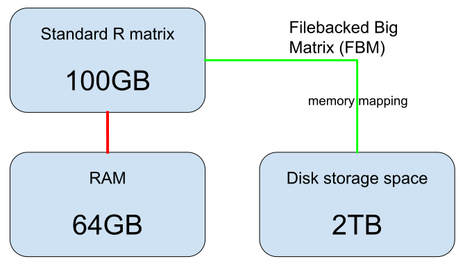
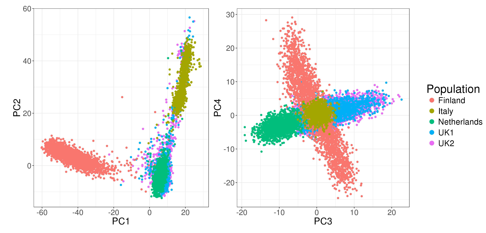
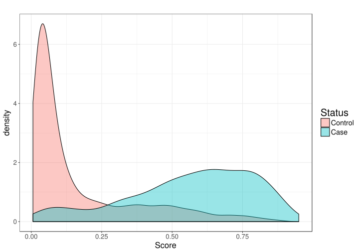

```{r setup, include=FALSE}
options(htmltools.dir.version = FALSE)
knitr::opts_chunk$set(echo = FALSE, fig.align = 'center', dev = "svg")

files <- c("test.bk", "test2.bk", "test2.rds")
stopifnot(all(
  sapply(files[file.exists(files)], file.remove)
))
library(bigstatsr)
```

class: title-slide center middle inverse

<br>

# Memory- and Computation-Efficient<br>Statistical Tools for Big Matrices

<br>

### R-Lille (April 2022)

<br>

### Florian Privé

#### Senior Researcher, Aarhus University (DK)

---

class: center middle inverse

# Motivation

---

## Working with very large genotype matrices

- previously: 15K x 280K, [celiac disease](https://doi.org/10.1038/ng.543) (~30GB)

- currently: 500K x 500K, [UK Biobank](https://doi.org/10.1101/166298) (~2TB)
 
```{r, out.width='55%'}
knitr::include_graphics("https://media.giphy.com/media/3o7bueyxGydy48Lwgo/giphy.gif")
```

.footnote[But I still want to use `r icon::fa_r_project()`..]

---

## The solution I found

```{r, out.width='90%'}

```

.footnote[Format `FBM` is very similar to format `filebacked.big.matrix` from package {bigmemory} (details in [this vignette](https://privefl.github.io/bigstatsr/articles/bigstatsr-and-bigmemory.html)).]

---

## How memory-mapping works

<br>

- when you access the 1st element (1st row, 1st col), it accesses a block (say the first column) from disk into memory (RAM)

- when you access the 2nd element (2nd row, 1st col), it is already in memory so it is accessed very fast

- when you access the second column, you access from disk again (once)

- you can access many columns like that, until you do not have enough memory anymore

- some space is freed automatically so that new columns can be accessed into memory

<br>

Everything is seamlessly managed by the operating system (OS).

---

class: center middle inverse

# Simple accessors

---

## Similar accessor as R matrices

```{r, echo=TRUE}
X <- FBM(2, 5, init = 1:10, backingfile = "test")
```

```{r, echo=TRUE}
X$backingfile
X[, 1]  ## ok
X[1, ]  ## bad
X[]     ## super bad
```

---

## Similar accessor as R matrices

```{r, echo=TRUE}
colSums(X[])  ## super bad
```

</br>

```{r, out.width='70%'}

```

---

## Split-(par)Apply-Combine Strategy

### Apply standard R functions to big matrices (in parallel)

```{r, out.width='95%'}
knitr::include_graphics("split-apply-combine.svg")
```

.footnote[Implemented in `big_apply()`.]

---

## Similar accessor as Rcpp matrices

```{Rcpp, echo=TRUE, eval=FALSE}
// [[Rcpp::plugins(cpp11)]]
// [[Rcpp::depends(bigstatsr, rmio)]]
#include <bigstatsr/BMAcc.h>

// [[Rcpp::export]]
NumericVector big_colsums(Environment BM) {
  
  XPtr<FBM> xpBM = BM["address"]; // get the external pointer
  BMAcc<double> macc(xpBM);       // create an accessor to the data
  
* size_t n = macc.nrow();
* size_t m = macc.ncol();
  
  NumericVector res(m);
  
  for (size_t j = 0; j < m; j++) 
    for (size_t i = 0; i < n; i++)
*     res[j] += macc(i, j);
  
  return res;
}
```

---

class: center middle inverse

# Some examples 

# from my work

---

## Partial Singular Value Decomposition

15K $\times$ 100K -- 10 first PCs -- 6 cores -- **1 min** (vs 2h in base R)

</br>

```{r, out.width='90%'}

```

.footnote[Implemented in `big_randomSVD()`, powered by R packages {RSpectra} and {Rcpp}.]

---

## Sparse linear models

### Predicting complex diseases with a penalized logistic regression

15K $\times$ 280K -- 6 cores -- **2 min** (10x faster than {glmnet})

Automatic (parallel) grid-search for the two hyper-parameters of elastic-net.

```{r, out.width='70%'}

```

---

class: center middle inverse

# Let us try some functions

# from `r icon::fa_r_project()` package {bigstatsr}

---

## Create an FBM object

```{r, echo=TRUE}
X <- FBM(10e3, 1000, backingfile = "test2")$save()
object.size(X)
file.size(X$backingfile)  ## 8 x 1e4 x 1e3
typeof(X)
```

```{r, echo=TRUE}
# `$save()` stored the object in an .rds file
# which you can reload in any R session
X <- big_attach("test2.rds")
```


---

## Fill the FBM with random values

```{r, out.width='65%'}
knitr::include_graphics("split-apply-combine.svg")
```

```{r, echo=TRUE}
big_apply(X, a.FUN = function(X, ind) {
  X[, ind] <- rnorm(nrow(X) * length(ind))
  NULL  ## Here, you don't want to return anything
}, a.combine = 'c')
```

```{r, echo=TRUE}
X[1:5, 1]
```

---

## Correlation matrix

```{r, echo=TRUE}
mat <- X[]
system.time(corr1 <- cor(mat))
```

```{r, echo=TRUE}
system.time(corr2 <- big_cor(X))
all.equal(corr1, corr2[])
```

---

## Partial Singular Value Decomposition

```{r, echo=TRUE, out.width="50%"}
system.time(svd1 <- svd(scale(mat), nu = 10, nv = 10))
```

```{r, echo=TRUE}
# Quadratic in the smallest dimension, linear in the other one
system.time(svd2 <- big_SVD(X, fun.scaling = big_scale(), k = 10))
```

```{r, echo=TRUE}
# Linear in both dimensions
# Extremely useful if both dimensions are very large
system.time(svd3 <- big_randomSVD(X, fun.scaling = big_scale(), k = 10))
```

---

## Multiple association

```{r}
set.seed(1)
```

```{r, echo=TRUE, fig.asp=0.7, out.width="63%"}
M <- 100 # number of causal variables
set <- sample(ncol(X), M)
y <- scale(X[, set]) %*% rnorm(M)
y <- y + rnorm(length(y), sd = 2 * sd(y))

mult_test <- big_univLinReg(X, y, covar.train = svd2$u)
plot(mult_test)
```

---

## Multiple association

```{r, echo=TRUE, fig.asp=0.6, out.width="85%"}
library(ggplot2)
plot(mult_test, type = "Manhattan") + 
  aes(color = cols_along(X) %in% set) +
  labs(color = "Causal?")
```

---

## Prediction

```{r, echo=TRUE, out.width="60%", fig.asp=0.8}
# Split the indices in train/test sets
ind.train <- sort(sample(nrow(X), size = 0.8 * nrow(X)))
ind.test <- setdiff(rows_along(X), ind.train)

# Train a linear model with elastic-net regularization
# and automatic choice of hyper-parameter lambda
train <- big_spLinReg(
  X, y[ind.train], 
  ind.train = ind.train,             # use a subset for training
  covar.train = svd2$u[ind.train, ], # use additional covariables
  pf.covar = rep(0, ncol(svd2$u)),   # do not penalize covariables
  alphas = c(1, 0.1, 0.01))          # try a grid of values for alpha
```

```{r, echo=TRUE, out.width="60%", fig.asp=0.8}
# Get predictions for the test set
pred <- predict(train, X = X, ind.row = ind.test, 
                covar.row = svd2$u[ind.test, ])
```

.footnote[A tutorial on fitting penalized regressions in [this vignette](https://privefl.github.io/bigstatsr/articles/penalized-regressions.html).]


---

## Prediction

```{r, echo=TRUE, out.width="60%", fig.asp=0.9}
# Plot true value vs prediction
qplot(pred, y[ind.test]) + 
  geom_abline(intercept = 0, slope = 1, color = "red") + 
  theme_bigstatsr()
```


---

class: center middle inverse

# Toy case: 

## Compute the sum for each column

---

## Brute force solution

```{r, echo=TRUE}
sums1 <- colSums(X[])  ## /!\ access all the data in memory
```

</br>

```{r, out.width='70%'}

```

---

## Do it by blocks

```{r, echo=TRUE}
sums2 <- big_apply(X, a.FUN = function(X, ind) colSums(X[, ind]), 
                   a.combine = 'c')

all.equal(sums2, sums1)
```

<br>

```{r, out.width='80%'}
knitr::include_graphics("split-apply-combine.svg")
```

---

## Using Rcpp (1/3)

```{Rcpp, echo=TRUE}
// [[Rcpp::plugins(cpp11)]]
// [[Rcpp::depends(bigstatsr, rmio)]]
#include <bigstatsr/BMAcc.h>

// [[Rcpp::export]]
NumericVector bigcolsums(Environment BM) {
  
  XPtr<FBM> xpBM = BM["address"]; // get the external pointer
  BMAcc<double> macc(xpBM);       // create an accessor to the data
  
  size_t n = macc.nrow(), m = macc.ncol();
  NumericVector res(m);  // vector of m zeros

  for (size_t j = 0; j < m; j++) 
    for (size_t i = 0; i < n; i++) 
      res[j] += macc(i, j);

  return res;
}
```

---

## Using Rcpp (1/3)

```{r, echo=TRUE}
sums3 <- bigcolsums(X)

all.equal(sums3, sums1)
```

---

## Using Rcpp (2/3): the bigstatsr way

```{Rcpp, echo=TRUE, eval=FALSE}
// [[Rcpp::plugins(cpp11)]]
// [[Rcpp::depends(bigstatsr, rmio)]]
#include <bigstatsr/BMAcc.h>

// [[Rcpp::export]]
NumericVector bigcolsums2(Environment BM,
*                         const IntegerVector& rowInd,
*                         const IntegerVector& colInd) {
  
  XPtr<FBM> xpBM = BM["address"];
* SubBMAcc<double> macc(xpBM, rowInd, colInd, 1);
  
* size_t n = macc.nrow(), m = macc.ncol();
  NumericVector res(m);  // vector of m zeros

  for (size_t j = 0; j < m; j++) 
    for (size_t i = 0; i < n; i++) 
*     res[j] += macc(i, j);

  return res;
}
```

```{Rcpp}
// [[Rcpp::plugins(cpp11)]]
// [[Rcpp::depends(bigstatsr, rmio)]]
#include <bigstatsr/BMAcc.h>

// [[Rcpp::export]]
NumericVector bigcolsums2(Environment BM,
                          const IntegerVector& rowInd,
                          const IntegerVector& colInd) {
  
  XPtr<FBM> xpBM = BM["address"];
  SubBMAcc<double> macc(xpBM, rowInd, colInd, 1);
  
  size_t i, j, n = macc.nrow(), m = macc.ncol();
  NumericVector res(m);  // vector of m zeros

  for (j = 0; j < m; j++) 
    for (i = 0; i < n; i++) 
      res[j] += macc(i, j);

  return res;
}
```

---

## Using Rcpp (2/3): the bigstatsr way

```{r, echo=TRUE}
sums4 <- bigcolsums2(X, rows_along(mat), cols_along(mat))

all.equal(sums4, sums1)
```

```{r, echo=TRUE}
sums5 <- bigcolsums2(X, rows_along(mat), 1:10)

all.equal(sums5, sums1[1:10])
```

---

## Using Rcpp (3/3): already implemented

```{r, echo=TRUE}
sums6 <- big_colstats(X)
str(sums6)

all.equal(sums6$sum, sums1)
```

---

class: center middle inverse

# Parallelism

---

## Most of the functions are parallelized

```{r, echo=TRUE}
ind.rep <- rep(cols_along(X), each = 100)  ## size: 100,000
(NCORES <- nb_cores())

system.time(
  mult_test2 <- big_univLinReg(X, y, covar.train = svd2$u,
                               ind.col = ind.rep)
)

system.time(
  mult_test3 <- big_univLinReg(X, y, covar.train = svd2$u,
                               ind.col = ind.rep, ncores = NCORES) 
)
```

---

## Parallelize your own functions

```{r, echo=TRUE}
system.time(
  mult_test4 <- big_parallelize(
    X, p.FUN = function(X, ind, y, covar) {
      bigstatsr::big_univLinReg(X, y, covar.train = covar,
                                ind.col = ind)
    }, p.combine = "rbind", ind = ind.rep, 
    ncores = NCORES, y = y, covar = svd2$u)
)
all.equal(mult_test4, mult_test3)
```

---

class: center middle inverse

# Conclusion

---

class: inverse, center, middle

# I'm able  to run algorithms
# on 100GB of data
# in `r icon::fa_r_project()` on my computer 

---

## Advantages of using FBM objects

<br>

- you can apply algorithms on **data larger than your RAM**,

- you can easily **parallelize** your algorithms because the data on disk is shared,

- you write **more efficient algorithms** (you do less copies and think more about what you're doing),

- you can use **different types of data**, for example, in my field, I’m storing my data with only 1 byte per element (rather than 8 bytes for a standard R matrix). See [the documentation of the FBM class](https://privefl.github.io/bigstatsr/reference/FBM-class.html) for details.


---

class: center middle inverse

# Two other packages

---

## {bigsparser}

<br>

Provides a Sparse matrix format with data on disk with some features:

- convert from a dgCMatrix/dsCMatrix to an SFBM, a Sparse Filebacked Big Matrix

- compute the product and crossproduct of an SFBM with a vector

- solve Ax=b, where A is a symmetric SFBM and b is a vector

- a new *compact* format is available, which is useful when non-zero values in columns are contiguous (or almost).

<br>

This package is intended for more efficient use of sparse data in C++ and also when parallelizing, since data on disk does not need copying.

---

## {bigsnpr}

<br>

Extends {bigstatsr} (and also uses {bigsparser}) with functions specific to genetic SNP data:

- to convert between formats, especially to an FBM

- wrappers around PLINK (e.g. for quality controls)

- special functions for PCA/SVD

- polygenic scores (predictors based on genetic data) methods

- multiple testing

- many utility functions and other algorithms

- functions that work directly on memory-mapped PLINK bed/bim/fam files    
(often using the same code, just with a different accessor)

---

## Contributions and extensions are welcome!

```{r, out.width='80%'}

```

---

### If we meet in-person someday, make sure to ask for an hex sticker

<br>

```{r, out.width='50%'}
knitr::include_graphics("https://raw.githubusercontent.com/privefl/bigstatsr/master/bigstatsr.png")
```

---

```{r cleanup, include=FALSE}
rm(X); gc()
sapply(files[file.exists(files)], file.remove)
```

class: inverse, center, middle

# Thanks!

<br>

Presentation available at    
https://privefl.github.io/R-presentation/bigrverse.html

<br>

<p style="font-size: 140%">`r icon::fa("twitter")` &#x2014; @privefl &#x2014; `r icon::fa("github")`</p>

<br>

.footnote[Slides created using R package [**xaringan**](https://github.com/yihui/xaringan)]
