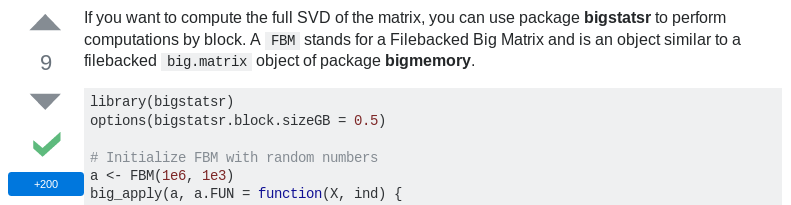

```{r setup, include=FALSE}
options(htmltools.dir.version = FALSE)
knitr::opts_chunk$set(echo = FALSE, fig.align = 'center')

files <- "test.bk"
stopifnot(all(
  sapply(files[file.exists(files)], file.remove)
))
library(bigstatsr)
```

class: title-slide center middle inverse

# The `r icon::fa_r()` package {bigstatsr}:<br/>memory- and computation-efficient tools<br/>for big matrices stored on disk

## Florian Privé (@privefl)

### Grenoble RUG - May 24, 2018

---

class: center middle inverse

# Motivation

---

## My thesis work

I'm a PhD Student (2016-2019) in **Predictive Human Genetics**.

$$\boxed{\Large{\text{Disease} \sim \text{DNA mutations} + \cdots}}$$

```{r, out.width="80%"}
knitr::include_graphics("PRS.png")
```

---

## Very large genotype matrices

- previously: 15K x 280K, [celiac disease](https://doi.org/10.1038/ng.543) (~30GB)

- currently: 500K x 500K, [UK Biobank](https://doi.org/10.1101/166298) (~2TB)
 
```{r, out.width='55%'}
knitr::include_graphics("https://media.giphy.com/media/3o7bueyxGydy48Lwgo/giphy.gif")
```

.footnote[But I still want to use `r icon::fa_r()`..]

---

## The solution I found

```{r, out.width='90%'}
knitr::include_graphics("memory-solution.svg")
```

.footnote[Format `FBM` is very similar to format `filebacked.big.matrix` from package {bigmemory} (details in [this vignette](https://privefl.github.io/bigstatsr/articles/bigstatsr-and-bigmemory.html)).]

---

class: center middle inverse

# Simple accessors

---

## Similar accessor as R matrices

```{r, echo=TRUE}
X <- FBM(2, 5, init = 1:10, backingfile = "test")
```

```{r, echo=TRUE}
X$backingfile
X[, 1]  ## ok
X[1, ]  ## bad
X[]     ## super bad
```

---

## Similar accessor as R matrices

```{r, echo=TRUE}
colSums(X[])  ## super bad
```

</br>

```{r, out.width='70%'}
knitr::include_graphics("caution.jpg")
```

---

## Split-(par)Apply-Combine Strategy

### Apply standard R functions to big matrices (in parallel)

```{r, out.width='95%'}
knitr::include_graphics("split-apply-combine.svg")
```

.footnote[Implemented in `big_apply()`.]

<!-- --- -->

<!-- ## Matrix operations -->

<!-- - (cross-)products with matrices/vectors -->

<!-- - special tricks for handling scaling ([vignette](https://privefl.github.io/bigstatsr/articles/operations-with-scaling.html) and [blog post](https://goo.gl/L8cNbo)) -->

<!-- <br/> -->

<!-- ### Example: computation of correlation of a 100,000 x 5000 matrix -->

<!-- - `cor`: 22 minutes -->

<!-- - `big_cor`: 1 minute -->

---

## Similar accessor as Rcpp matrices

```{Rcpp, echo=TRUE, eval=FALSE}
// [[Rcpp::depends(BH, bigstatsr)]]
#include <bigstatsr/BMAcc.h>

// [[Rcpp::export]]
NumericVector big_colsums(Environment BM) {
  
  XPtr<FBM> xpBM = BM["address"]; 
  BMAcc<double> macc(xpBM); 
  
* size_t n = macc.nrow();
* size_t m = macc.ncol();
  
  NumericVector res(m);
  
  for (size_t j = 0; j < m; j++) 
    for (size_t i = 0; i < n; i++)
*     res[j] += macc(i, j);
  
  return res;
}
```

---

## Partial Singular Value Decomposition

15K $\times$ 100K -- 10 first PCs -- 6 cores -- **1 min** (vs 2h in base R)

</br>

```{r, out.width='90%'}
knitr::include_graphics("PC1-4.png")
```

.footnote[Implemented in `big_randomSVD()`, powered by R packages {RSpectra} and {Rcpp}.]

---

## Sparse linear models

### Predicting complex diseases with a penalized logistic regression

15K $\times$ 280K -- 6 cores -- **2 min**

```{r, out.width='75%'}
knitr::include_graphics("density-scores.svg")
```

---

## Other functions


- matrix operations

- association of each variable with an output

- plotting functions

- read from text files

- many other functions..

<br>

### Parallel

- most of the functions are parallelized (memory-mapping makes it easy!)

- you can parallelize you own functions with `big_parallelize()`

<!-- --- -->

<!-- ## Bonus -->

<!-- ### When you earn 305 pts on Stack Overflow with your new package -->

<!-- <br> -->

<!-- ```{r, out.width='85%'} -->
<!--  -->
<!-- ``` -->

<!-- <br> -->

<!-- ```{r, out.width='20%'} -->
<!--  -->
<!-- ``` -->


---

class: inverse, center, middle

# I'm able  to run algorithms
# on 100GB of data
# in `r icon::fa_r()` on my computer 

---

## R Packages

<br>

<a href="https://doi.org/10.1093/bioinformatics/bty185" target="_blank">
```{r, out.width='70%'}
knitr::include_graphics("bty185.png")
```
</a>

<br>

- {bigstatsr}: to be used by any field of research

- {bigsnpr}: algorithms specific to my field of research

---

## Contributors are welcomed!

```{r, out.width='80%'}
knitr::include_graphics("cat-help.jpg")
```

---

```{r cleanup, include=FALSE}
sapply(files[file.exists(files)], file.remove)
```

class: inverse, center, middle

# Thanks!

<br/><br/>

Presentation: https://privefl.github.io/eRum-2018/slides.html

Package's website: https://privefl.github.io/bigstatsr/

DOI: [10.1093/bioinformatics/bty185](https://doi.org/10.1093/bioinformatics/bty185)

<br/>

`r icon::fa("twitter")` [privefl](https://twitter.com/privefl) &nbsp;&nbsp;&nbsp;&nbsp; `r icon::fa("github")` [privefl](https://github.com/privefl) &nbsp;&nbsp;&nbsp;&nbsp; `r icon::fa("stack-overflow")` [F. Privé](https://stackoverflow.com/users/6103040/f-priv%c3%a9)


.footnote[Slides created via the R package [**xaringan**](https://github.com/yihui/xaringan).]
