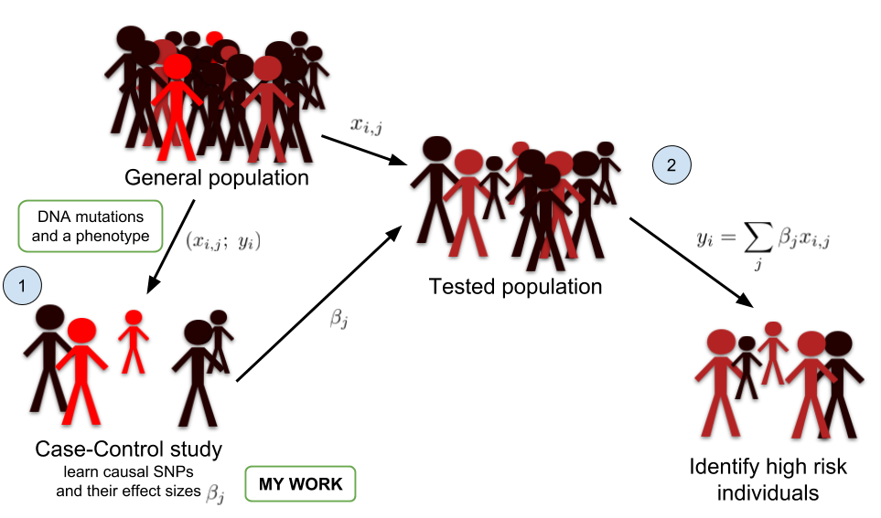

```{r setup, include=FALSE}
options(htmltools.dir.version = FALSE)
knitr::opts_chunk$set(echo = FALSE, fig.align = 'center', dev = "svg")

files <- c("test.bk", "test2.bk")
stopifnot(all(
  sapply(files[file.exists(files)], file.remove)
))
library(bigstatsr)
```

class: title-slide center middle inverse

# The `r icon::fa_r()` package {bigstatsr}:<br/>memory- and computation-efficient tools<br/>for big matrices stored on disk

## Florian Privé (@privefl)

### Grenoble RUG - May 24, 2018

---

class: center middle inverse

# Motivation

---

## My thesis work

I'm a PhD Student (2016-2019) in **Predictive Human Genetics**.

$$\boxed{\Large{\text{Disease} \sim \text{DNA mutations} + \cdots}}$$

```{r, out.width="80%"}

```

---

## Very large genotype matrices

- previously: 15K x 280K, [celiac disease](https://doi.org/10.1038/ng.543) (~30GB)

- currently: 500K x 500K, [UK Biobank](https://doi.org/10.1101/166298) (~2TB)
 
```{r, out.width='55%'}
knitr::include_graphics("https://media.giphy.com/media/3o7bueyxGydy48Lwgo/giphy.gif")
```

.footnote[But I still want to use `r icon::fa_r()`..]

---

## The solution I found

```{r, out.width='90%'}
knitr::include_graphics("memory-solution.svg")
```

.footnote[Format `FBM` is very similar to format `filebacked.big.matrix` from package {bigmemory} (details in [this vignette](https://privefl.github.io/bigstatsr/articles/bigstatsr-and-bigmemory.html)).]

---

class: center middle inverse

# Simple accessors

---

## Similar accessor as R matrices

```{r, echo=TRUE}
X <- FBM(2, 5, init = 1:10, backingfile = "test")
```

```{r, echo=TRUE}
X$backingfile
X[, 1]  ## ok
X[1, ]  ## bad
X[]     ## super bad
```

---

## Similar accessor as R matrices

```{r, echo=TRUE}
colSums(X[])  ## super bad
```

</br>

```{r, out.width='70%'}
knitr::include_graphics("caution.jpg")
```

---

## Split-(par)Apply-Combine Strategy

### Apply standard R functions to big matrices (in parallel)

```{r, out.width='95%'}
knitr::include_graphics("split-apply-combine.svg")
```

.footnote[Implemented in `big_apply()`.]

---

## Similar accessor as Rcpp matrices

```{Rcpp, echo=TRUE, eval=FALSE}
// [[Rcpp::depends(BH, bigstatsr)]]
#include <bigstatsr/BMAcc.h>

// [[Rcpp::export]]
NumericVector big_colsums(Environment BM) {
  
  XPtr<FBM> xpBM = BM["address"]; 
  BMAcc<double> macc(xpBM); 
  
* size_t n = macc.nrow();
* size_t m = macc.ncol();
  
  NumericVector res(m);
  
  for (size_t j = 0; j < m; j++) 
    for (size_t i = 0; i < n; i++)
*     res[j] += macc(i, j);
  
  return res;
}
```

---

class: center middle inverse

# Some examples 

# from my work

---

## Partial Singular Value Decomposition

15K $\times$ 100K -- 10 first PCs -- 6 cores -- **1 min** (vs 2h in base R)

</br>

```{r, out.width='90%'}
knitr::include_graphics("PC1-4.png")
```

.footnote[Implemented in `big_randomSVD()`, powered by R packages {RSpectra} and {Rcpp}.]

---

## Sparse linear models

### Predicting complex diseases with a penalized logistic regression

15K $\times$ 280K -- 6 cores -- **2 min**

```{r, out.width='75%'}
knitr::include_graphics("density-scores.svg")
```

---

class: center middle inverse

# Let us try 

# some functions

---

## Create an FBM object

```{r, echo=TRUE}
X <- FBM(10e3, 1000, backingfile = "test2")
object.size(X)
file.size(X$backingfile)  ## 8 x 1e4 x 1e3

typeof(X)
```

---

## Fill it with random values

```{r, out.width='65%'}
knitr::include_graphics("split-apply-combine.svg")
```

```{r, echo=TRUE}
big_apply(X, a.FUN = function(X, ind) {
  X[, ind] <- rnorm(nrow(X) * length(ind))
  NULL  ## Here, you don't want to return anything
}, a.combine = 'c')
```

```{r, echo=TRUE}
X[1:5, 1]
```

---

## Correlation matrix

```{r, echo=TRUE}
mat <- X[]
system.time(corr1 <- cor(mat))
```

```{r, echo=TRUE}
system.time(corr2 <- big_cor(X))
all.equal(corr1, corr2[])
```

---

## Partial Singular Value Decomposition

```{r, echo=TRUE, out.width="50%"}
system.time(svd1 <- svd(scale(mat), nu = 10, nv = 10))
```

```{r, echo=TRUE}
# Quadratic in the smallest dimension, linear in the other one
system.time(svd2 <- big_SVD(X, fun.scaling = big_scale(), k = 10))
```

```{r, echo=TRUE}
# Linear in both dimensions
# Extremely useful if both dimensions are very large
system.time(svd3 <- big_randomSVD(X, fun.scaling = big_scale(), k = 10))
```

---

## Multiple association

```{r}
set.seed(1)
```

```{r, echo=TRUE, fig.asp=0.7, out.width="63%"}
M <- 100 # number of causal variables
set <- sample(ncol(X), M)
y <- scale(X[, set]) %*% rnorm(M)
y <- y + rnorm(length(y), sd = 2 * sd(y))

mult_test <- big_univLinReg(X, y, covar.train = svd2$u)
hist(pval <- predict(mult_test, log10 = FALSE))
```

---

### P-values

```{r, echo=TRUE, fig.asp=0.6, out.width="85%"}
library(ggplot2)
plot(mult_test) + 
  aes(color = cols_along(X) %in% set) +
  labs(color = "Causal?")
```

---

## Predictive models

```{r, echo=TRUE, out.width="60%", fig.asp=0.8}
# Split the indices in train/test sets
ind.train <- sort(sample(nrow(X), size = 0.8 * nrow(X)))
ind.test <- setdiff(rows_along(X), ind.train)

# Train a linear model with elastic-net regularization
# and automatic choice of hyper-parameter lambda
train <- big_spLinReg(X, y[ind.train], ind.train = ind.train, 
                      covar.train = svd2$u[ind.train, ])
```

---

## Prediction on test set

```{r, echo=TRUE, out.width="55%", fig.asp=0.8}
# Get K=10 predictions for the test set
preds <- predict(train, X = X, ind.row = ind.test, 
                 covar.row = svd2$u[ind.test, ])
# Average all the predictions
pred <- rowMeans(preds)
# Plot true value vs prediction
plot(pred, y[ind.test], pch = 20); abline(0, 1, col = "red")
```


---

class: center middle inverse

# Toy case: 

## Compute the sums of each column

---

## Brute force solution

```{r, echo=TRUE}
sums1 <- colSums(X[])  ## /!\ access all the data in memory
```

</br>

```{r, out.width='70%'}
knitr::include_graphics("caution.jpg")
```

---

## Do it by blocks

```{r, echo=TRUE}
sums2 <- big_apply(X, a.FUN = function(X, ind) colSums(X[, ind]), 
                   a.combine = 'c')

all.equal(sums2, sums1)
```

<br>

```{r, out.width='80%'}
knitr::include_graphics("split-apply-combine.svg")
```

---

## Using Rcpp (1/3)

```{Rcpp, echo=TRUE}
// [[Rcpp::depends(bigstatsr, BH)]]
#include <bigstatsr/BMAcc.h>
#include <Rcpp.h>
using namespace Rcpp;

// [[Rcpp::export]]
NumericVector bigcolsums(Environment BM) {
  
  XPtr<FBM> xpBM = BM["address"];  // get the external pointer
  BMAcc<double> macc(xpBM);        // create an accessor to the data
  
  size_t i, j, n = macc.nrow(), m = macc.ncol();
  NumericVector res(m);  // vector of m zeros

  for (j = 0; j < m; j++) 
    for (i = 0; i < n; i++) 
      res[j] += macc(i, j);

  return res;
}
```

---

## Using Rcpp (1/3)

```{r, echo=TRUE}
sums3 <- bigcolsums(X)

all.equal(sums3, sums1)
```

---

## Using Rcpp (2/3): the bigstatsr way

```{Rcpp, echo=TRUE, eval=FALSE}
// [[Rcpp::depends(bigstatsr, BH)]]
#include <bigstatsr/BMAcc.h>
#include <Rcpp.h>
using namespace Rcpp;

// [[Rcpp::export]]
NumericVector bigcolsums2(Environment BM,
*                         const IntegerVector& rowInd,
*                         const IntegerVector& colInd) {
  
  XPtr<FBM> xpBM = BM["address"];
* SubBMAcc<double> macc(xpBM, rowInd - 1, colInd - 1);
  
  size_t i, j, n = macc.nrow(), m = macc.ncol();
  NumericVector res(m);  // vector of m zeros

  for (j = 0; j < m; j++) 
    for (i = 0; i < n; i++) 
*     res[j] += macc(i, j);

  return res;
}
```

```{Rcpp}
// [[Rcpp::depends(bigstatsr, BH)]]
#include <bigstatsr/BMAcc.h>
#include <Rcpp.h>
using namespace Rcpp;

// [[Rcpp::export]]
NumericVector bigcolsums2(Environment BM,
                          const IntegerVector& rowInd,
                          const IntegerVector& colInd) {
  
  XPtr<FBM> xpBM = BM["address"];
  SubBMAcc<double> macc(xpBM, rowInd - 1, colInd - 1);
  
  size_t i, j, n = macc.nrow(), m = macc.ncol();
  NumericVector res(m);  // vector of m zeros

  for (j = 0; j < m; j++) 
    for (i = 0; i < n; i++) 
      res[j] += macc(i, j);

  return res;
}
```

---

## Using Rcpp (2/3): the bigstatsr way

```{r, echo=TRUE}
sums4 <- bigcolsums2(X, rows_along(mat), cols_along(mat))

all.equal(sums4, sums1)
```

```{r, echo=TRUE}
sums5 <- bigcolsums2(X, rows_along(mat), 1:10)

all.equal(sums5, sums1[1:10])
```

---

## Using Rcpp (3/3): already implemented

```{r, echo=TRUE}
sums6 <- big_colstats(X)
str(sums6)

all.equal(sums6$sum, sums1)
```

---

class: center middle inverse

# Conclusion

---

class: inverse, center, middle

# I'm able  to run algorithms
# on 100GB of data
# in `r icon::fa_r()` on my computer 

---

## Advantages of using FBM objects

- you can apply algorithms on 100GB of data,

- you can easily parallelize your algorithms because the data on disk is shared,

- you write more efficient algorithms,

- you can use different types of data, for example, in my field, I’m storing my data with only 1 byte per element (rather than 8 bytes for a standard R matrix). See [the documentation of the FBM class](https://privefl.github.io/bigstatsr/reference/FBM-class.html) for details.


---

## R Packages

<br>

<a href="https://doi.org/10.1093/bioinformatics/bty185" target="_blank">
```{r, out.width='70%'}
knitr::include_graphics("bty185.png")
```
</a>

<br>

- {bigstatsr}: to be used by any field of research

- {bigsnpr}: algorithms specific to my field of research

---

## Contributors are welcomed!

```{r, out.width='80%'}
knitr::include_graphics("cat-help.jpg")
```

---

## Make sure to grab an hex sticker

```{r, out.width='70%'}
knitr::include_graphics("https://raw.githubusercontent.com/privefl/bigstatsr/master/bigstatsr.png")
```

---

```{r cleanup, include=FALSE}
sapply(files[file.exists(files)], file.remove)
```

class: inverse, center, middle

# Thanks!

<br/><br/>

Presentation: https://privefl.github.io/eRum-2018/slides.html

Package's website: https://privefl.github.io/bigstatsr/

DOI: [10.1093/bioinformatics/bty185](https://doi.org/10.1093/bioinformatics/bty185)

<br/>

`r icon::fa("twitter")` [privefl](https://twitter.com/privefl) &nbsp;&nbsp;&nbsp;&nbsp; `r icon::fa("github")` [privefl](https://github.com/privefl) &nbsp;&nbsp;&nbsp;&nbsp; `r icon::fa("stack-overflow")` [F. Privé](https://stackoverflow.com/users/6103040/f-priv%c3%a9)


.footnote[Slides created via the R package [**xaringan**](https://github.com/yihui/xaringan).]
