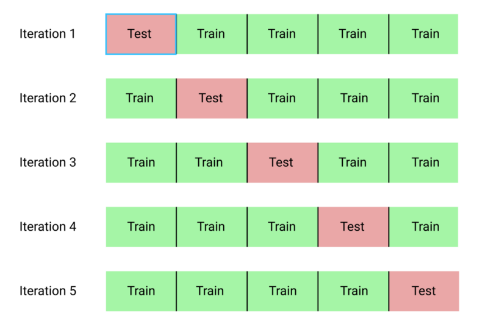

```{r setup, include=FALSE}
knitr::opts_chunk$set(fig.align = 'center', dev = "svg", out.width = "70%",
                      echo = TRUE, comment = "", fig.width = 5)
options(width = 70)
knitr::opts_knit$set(global.par = TRUE)
```

class: title-slide center middle inverse

<br>

# Session 4.<br>Penalised methods for genetic data analysis

<br>

## Florian Privé

### King's College London -- May 20, 2019

<br>

<br>

**Slides:** `https://privefl.github.io/R-presentation/penalised-genetics.html`

---

class: inverse, center, middle

# Introduction to penalized models

---

## Multiple linear regression

We want to solve

$$y = \beta_0 + \beta_1 G_1 + \cdots + \beta_p G_p + \gamma_1 COV_1 + \cdots + \gamma_q COV_q + \epsilon~.$$
--

Let $\beta = (\beta_0, \beta_1, \dots, \beta_p, \gamma_1, \dots, \gamma_q)$ and $X = [1; G_1; \dots;G_p; COV_1; \dots; COV_q]$, then

$$y = X \beta + \epsilon~.$$

--

This is equivalent to minimizing

$$||y - X \beta||_2^2 =  ||\epsilon||_2^2~,$$
--

whose solution is 

$$\beta = (X^T X)^{-1} X^T y~.$$

--

<br>

**What is the problem when analyzing genotype data?**

--

$$n < p$$

---

## Penalization term -- $L_2$ regularization

<br>

Instead, we can minimize

$$||y - X \beta||_2^2 + \lambda ||\beta||_2^2~,$$
--

whose solution is 

$$\beta = (X^T X + \lambda I)^{-1} X^T y~.$$

--

<br>

This is the L2-regularization ("**ridge**", Hoerl and Kennard, 1970); **it shrinks coefficients $\beta$ towards 0**.

.footnote[https://doi.org/10.1080/00401706.1970.10488634]

---

## Penalization term -- $L_1$ regularization

<br>

Instead, we can minimize

$$||y - X \beta||_2^2 + \lambda ||\beta||_1~,$$
--

which does not have any closed form but can be solved using iterative algorithms.

--

<br>

This is the L1-regularization ("**lasso**", Tibshirani, 1996); **it forces some of the coefficients to be equal to 0** and can be used as a means of variable selection, leading to sparse models.

.footnote[https://doi.org/10.1111/j.2517-6161.1996.tb02080.x]

---

## Penalization term -- $L_1$ and $L_2$ regularization

<br>

Instead, we can minimize

$$||y - X \beta||_2^2 + \lambda (\alpha ||\beta||_1 + (1 - \alpha) ||\beta||_2^2)~,$$
--

which does not have any closed form but can be solved using iterative algorithms ( $0 \le \alpha \le 1$ ).

--

<br>

This is the L1- and L2-regularization ("**elastic-net**", Zou and Hastie, 2005); it is a compromise between the two previous penalties.

.footnote[https://doi.org/10.1111/j.1467-9868.2005.00503.x]

---

## Advantages and drawbacks of penalization

--

### Advantages

- Make it possible to solve the linear problem

- Generally prevents overfitting (because of smaller effects)

--

### Drawback

- Add at least one hyper-parameter ( $\lambda$ ) that needs to be chosen and another one if using the elastic-net regularization ( $\alpha$ )

--

### Alternative

- Select a few variables before fitting the linear model (e.g. using marginal significance/p-values); heuristic: $p = n / 10$

---

## Binary outcome (case-control)

**Penalized logistic regression**: minimize

$$L(\lambda, \alpha) = \underbrace{ -\sum_{i=1}^n \left( y_i \log\left(z_i\right) + (1 - y_i) \log\left(1 - z_i\right) \right) }_\text{Loss function}$$
    
$$+ \underbrace{ \lambda \left((1-\alpha)\|\beta\|_2^2 + \alpha \|\beta\|_1\right) }_\text{Penalization} ~,$$

where $z_i=1/\left(1+\exp\left(-(\beta_0 + X_{(i)}^T\beta)\right)\right)$, $X_i$ denotes the genotypes and covariates (e.g. principal components) for individual $i$, and $y_i$ is the disease status for individual $i$.

---

class: inverse, center, middle

# Code in practice

---

## Data

Download [data](https://github.com/privefl/bigsnpr/raw/master/data-raw/public-data.zip) and unzip files. 

I store those files in a directory called "tmp-data" here.

```{r, eval=FALSE}
# Convert the bed/bim/fam data to the format used 
# by packages {bigstatsr} and {bigsnpr}.
bigsnpr::snp_readBed("tmp-data/public-data.bed")
```

```{r}
# Access the genotype matrix and the phenotype
data <- bigsnpr::snp_attach("tmp-data/public-data.rds")
G <- data$genotypes
X <- G[]  ## 560 MB
y <- data$fam$affection - 1
```

```{r}
# Divide the indices in training/test sets
set.seed(1)
n <- nrow(X)
ind.train <- sample(n, 400)
ind.test <- setdiff(1:n, ind.train)
```

---

## Multiple logistic model

<br>

```{r, eval=FALSE}
mod <- glm(y[ind.train] ~ X[ind.train, ], family = "binomial")
```

```
Error: cannot allocate vector of size 128.4 Gb
In addition: Warning message:
glm.fit: algorithm did not converge 
```

<br>

### Prioritizing on marginal p-values

```{r, message=FALSE}
library(bigstatsr)
gwas <- big_univLogReg(G, y[ind.train], ind.train = ind.train,
                       ncores = nb_cores())
pval <- predict(gwas, log10 = FALSE)
ind <- order(pval)
```

---

## Multiple logistic model after selection

```{r}
df <- data.frame(y = y, X.sub = I(X[, ind[1:40]]))
mod <- glm(y ~ X.sub, data = df, subset = ind.train, 
           family = "binomial")
pred <- predict(mod, df[ind.test, ], type = "response")
AUCBoot(pred, y[ind.test])
```

--

```{r, fig.asp=0.4}
library(ggplot2)
ggplot(data.frame(pheno = as.factor(y[ind.test]), pred = pred)) + 
  geom_density(aes(pred, fill = pheno), alpha = 0.3)
```

---

## Penalized models using {glmnet}

```{r, message=FALSE}
library(glmnet)
```

```{r, cache=TRUE}
mod2 <- glmnet(X[ind.train, ], y[ind.train], family = "binomial")
pred2 <- predict(mod2, X[ind.test, ], type = "response")
```

```{r, echo=FALSE}
par(mar = c(4, 4, 1, 1))
```

```{r, fig.asp=0.58}
plot(mod2$lambda[-1], apply(pred2, 2, AUC, target = y[ind.test])[-1],
     xlim = rev(range(mod2$lambda)), log = "x", pch = 20,
     xlab = expression(lambda~~(log-scale)), ylab = "AUC (on test set)")
```

---

## From underfitting to overfitting

```{r, warning=FALSE, fig.asp=0.85}
plot(mod2$dev.ratio, pch = 20, log = "y")
```

---

class: inverse, center, middle

# Evaluating models

---

## Dividing in training / test sets

What is the issue with this?

What would be a better solution?

--

**K-fold cross-validation** (here, K = 5):

```{r, echo=FALSE}

```

---

## A possible implementation

```{r}
set.seed(1)
K <- 5
test_grp <- sample(rep_len(1:K, n))
head(test_grp, 20)
sapply(1:K, function(k) {
  ind.test  <- which(test_grp == k)
  ind.train <- which(test_grp != k)
  ## Replace with your preferred model
  df <- data.frame(y = y, x = X[, 1])
  mod <- glm(y ~ x, data = df, subset = ind.train, family = "binomial")
  pred <- predict(mod, df[ind.test, ], type = "response")
  AUC(pred, y[ind.test])
})
```

---

## Using cross-validation for parameter(s) selection

```{r, cache = TRUE}
aucs <- sapply(1:K, function(k) {
  ind.test  <- which(test_grp == k)
  ind.train <- which(test_grp != k)
  ## Replace with your preferred model
  df <- data.frame(y = y, x = X[, 1])
  mod <- glmnet(X[ind.train, ], y[ind.train], family = "binomial")
  pred <- predict(mod, X[ind.test, ], type = "response")
  apply(pred, 2, AUC, target = y[ind.test])
})
```

```{r, fig.asp=0.45}
plot(rowMeans(aucs)[-1], pch = 20, ylab = "Mean AUC")
```

---

## Both parameter selection and evaluation

How to do this?

We already used all data to find best parameter $\lambda$..

--

**Nested** cross-validation (here 5x2 nested CV):

```{r, echo=FALSE, out.width="75%"}
knitr::include_graphics("nested-crossval.png")
```
