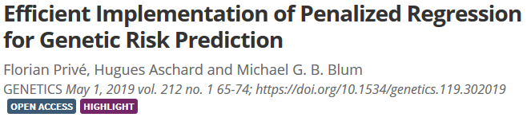

```{r setup, include=FALSE}
options(htmltools.dir.version = FALSE)
knitr::opts_chunk$set(echo = FALSE, fig.align = 'center')
```

class: title-slide center middle inverse

# Ultra fast penalized regressions<br>with `r icon::fa_r_project()` package {bigstatsr}

<br>

## e-Rum 2020

<br>

### Florian Privé (@privefl)
#### postdoc in *Predictive Human Genetics*

---

## {bigstatsr} uses memory-mapping

```{r, out.width='85%'}
knitr::include_graphics("memory-solution.svg")
```

.footnote[`FBM` is very similar to `filebacked.big.matrix` from package {bigmemory}.]

---

## Penalized linear regression 

<br>

with **lasso** ( $\alpha=1$ ) or **elastic-net** regularization ( $0 < \alpha < 1$ )

$$L(\lambda, \alpha) = \underbrace{ ||y - X \beta||_2^2 }_\text{Loss function} + \underbrace{ \lambda \left( \alpha \|\beta\|_1 + (1-\alpha) \frac{\|\beta\|_2^2}{2}  \right) }_\text{Penalisation}$$

<br>

Two hyper-parameters in this model:

- $\lambda$

- $\alpha$

---

## Science and Implementation

<br>

- Use fast underlying **C++** code

- Use **strong rules** to discard variables a priori

- Use **early-stopping** to avoid fitting costly models

- Process the hyper-parameter **grid in parallel** <br>(memory-mapping makes it easy and efficient)

.footnote[Strong rules: DOI: [10.1111%2Fj.1467-9868.2011.01004.x](https://doi.org/10.1111/j.1467-9868.2011.01004.x)]

---

## Predicting common diseases from genetics

15K $\times$ 280K in **a few minutes**

```{r, out.width='85%'}
knitr::include_graphics("density-scores.svg")
```

---

## Predicting height from genetics

350K $\times$ 560K in **one day**

```{r, out.width='85%'}
knitr::include_graphics("https://privefl.github.io/blog/images/UKB-final-pred.png")
```

---

class: inverse, center, middle

#  `r icon::fa_r_project()` package {bigstatsr}
# makes it possible 
# to fit penalized linear/logistic regression
# on 100s of GB of data

---

## Other functions

- Principal Component Analysis (PCA)

- matrix operations

- association of each variable with an output

- plotting functions

- read from text files

- many other functions..

<br>

### Parallel

- most of the functions are parallelized (memory-mapping makes it easy!)

- you can parallelize you own functions with `big_parallelize()`

---

## Scientific publications

<br>

<a href="https://doi.org/10.1093/bioinformatics/bty185" target="_blank">
```{r, out.width='70%'}
knitr::include_graphics("bty185.png")
```
</a>

<br>

- {bigstatsr}: to be used by any field of research

- {bigsnpr}: algorithms specific to my field of research, Human Genetics

<br>

<a href="https://doi.org/10.1534/genetics.119.302019" target="_blank">
```{r, out.width='70%'}

```
</a>

---

## Contributions are welcome!

```{r, out.width='75%'}
knitr::include_graphics("cat-help.jpg")
```

---

class: inverse, center, middle

# Thanks!

<br/><br/>

#### Go check the package website and the vignette!

<!-- Package's website: https://privefl.github.io/bigstatsr/ -->

<br/>

`r icon::fa("twitter")` [privefl](https://twitter.com/privefl) &nbsp;&nbsp;&nbsp;&nbsp; `r icon::fa("github")` [privefl](https://github.com/privefl) &nbsp;&nbsp;&nbsp;&nbsp; `r icon::fa("stack-overflow")` [F. Privé](https://stackoverflow.com/users/6103040/f-priv%c3%a9)


.footnote[Slides created using `r icon::fa_r_project()` package [**xaringan**](https://github.com/yihui/xaringan).]
